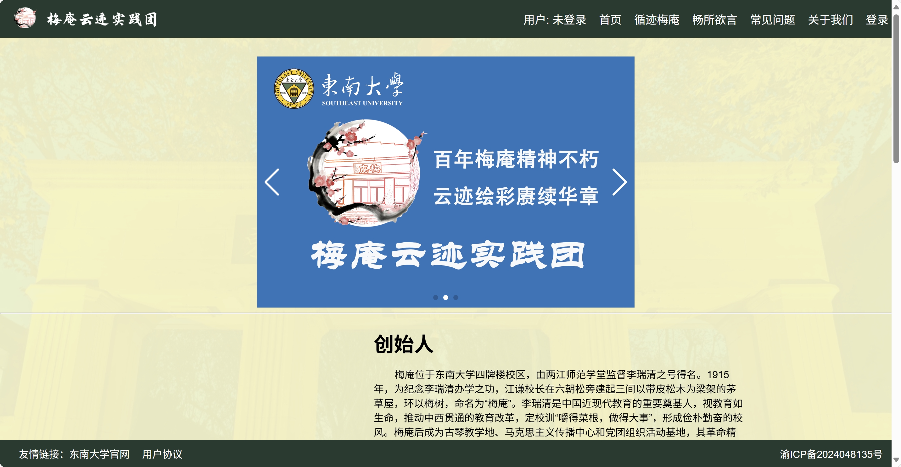
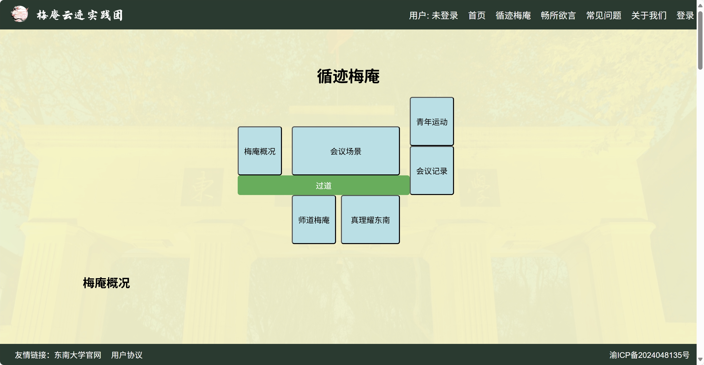
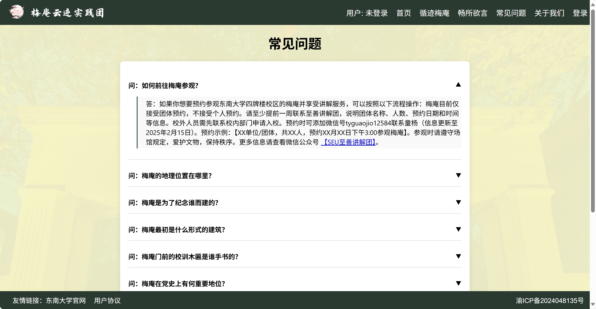
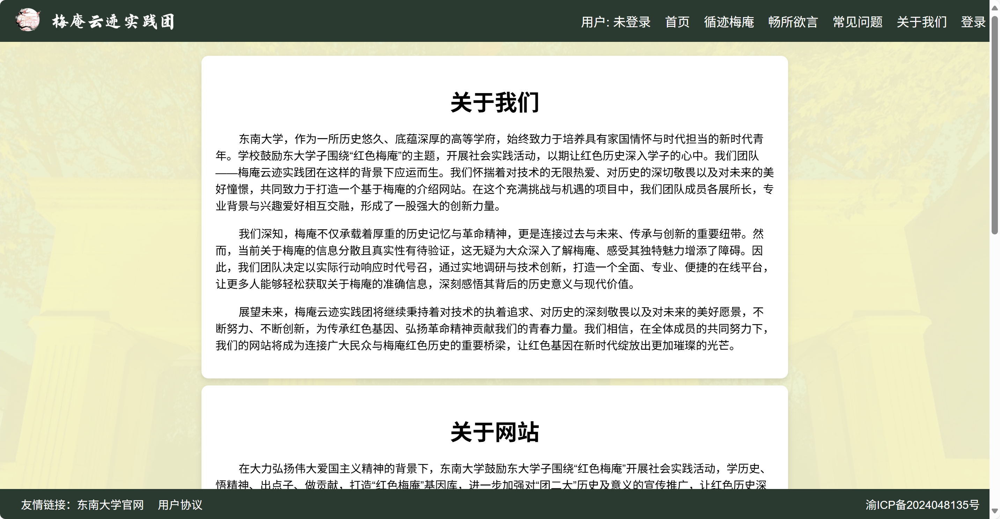

# Meian Cloud Website Project
[**简体中文**](README.zh-cn.md) | [English](#)   
*(If you prefer Chinese, see [README.zh-cn.md](README.zh-CN.md).)*
## Project Introduction
"Meian Cloud" is a website planned and implemented by the 梅庵云迹实践团, which showcases the historical culture of Meian in Southeast University through digital means. By combining front - end and back - end technologies, the project realizes functions such as Meian culture display, user interaction, and comment management, aiming to let more people understand the historical heritage and unique charm of Meian.

---

## Technology Stack
### Front - end
- **Core Technologies**: HTML5, CSS3, JavaScript
- **Animation Effects**: Fade - in and fade - out page transitions, dynamic component interactions
- **Design Style**: Unified color scheme, responsive layout

### Back - end
- **Framework**: Django 4.2 + Python 3.11
- **Function Implementation**: User authentication, comment management, dynamic template rendering
- **Database**: MySQL

---

## Function Module Introduction
1. **Home Page**  
The "Home Page" mainly introduces the core information of Meian. The carousel displays pictures of Meian and the team flag in a loop, showing the appearance of Meian and our team's practice journey. The text part comprehensively and briefly introduces Meian from multiple perspectives, including its historical culture, its special status as the venue of the Second National Congress of the Communist Youth League of China, and its influence and significance on future generations.


2. **Tracing Meian**  
The "Tracing Meian" section focuses on displaying the exhibits and related introductions in the five exhibition halls inside Meian. Each exhibition hall's introduction is accompanied by selected photos taken by our team, providing visitors with an immersive visiting experience. To facilitate visitors to quickly find the introductions of various locations in Meian, this section also features an overview map of Meian. Visitors can simply click on the corresponding location to jump to the detailed introduction page of the corresponding exhibition hall, greatly enhancing the browsing convenience.


3. **Free Discussion**  
The "Free Discussion" section is the interactive comment area of the website. After logging in, users can put forward suggestions, questions, or express their opinions. Meanwhile, our team and other users can reply to the comments, realizing two - way information exchange. This function not only enhances user participation but also provides a user feedback channel for the continuous optimization of the website.


4. **Frequently Asked Questions**  
The "Frequently Asked Questions" section answers common questions that users may ask, covering aspects such as historical details, visiting guides, and cultural values of Meian. By sorting out and answering these questions in advance, it can effectively improve the user experience and reduce the confusion that users may encounter during browsing.


5. **About Us**  
The "About Us" section mainly introduces the overview of the development team, the development background, technical architecture, and subsequent development plans of the website. Through this section, users can have a more comprehensive understanding of the website's production team and operation concept, enhancing users' trust in the website.


6. **User System**  
With the user system, users can register and log in. After logging in, users can set their avatars, modify personal information (such as gender, birthday, personal signature, etc.), and change passwords, greatly improving the user experience.

---

## Access Methods
- **Online Address**: [https://www.meiancloud.site](https://www.meiancloud.site)
- **Local Deployment**:
```shell
# First, make sure Python 3.11 is installed
# Clone the repository
git clone https://github.com/r1Way/meiancloud
# Navigate to the project directory
cd ./meiancloud/meiancloud
# Install dependencies
pip3 install -r requirements.txt
# Start the service
python3 manage.py runserver
```
---

## Developers
Thanks to all the members of the 梅庵云迹实践团 for their efforts and contributions.

Special thanks to the following core developers for their contributions:

<table>
  <tr>
    <td align="center">
      <a href="https://github.com/r1Way">
        
        <br />
        <sub><b>r1Way (Team Leader)</b></sub>
      </a>
    </td>
    <td align="center">
      <a href="https://github.com/WeiKnight0">
        
        <br />
        <sub><b>WeiKnight</b></sub>
      </a>
    </td>
  </tr>
</table>

Thanks to their day - and - night coding, debugging, and optimization, this project has been realized!

⭐ **If this project is helpful to you, please give us a Star!** ⭐

Your support is our greatest motivation for continuous improvement. [[Project Address]](https://github.com/r1Way/meiancloud)


---

## Copyright Statement
- The copyright of Meian's historical materials belongs to Southeast University.
- The ownership of the website belongs to the 梅庵云迹实践团.
- The open - source license for the website code is the MIT License.
- The source of image materials should be indicated.

---
---
# Appendix: Website Building Experience Sharing (Chinese Only)
<!-- 
# Meian Cloud Website

[Website link www.meiancloud.site](https://meiancloud.site/)

## Project Address

[r1Way/meian_web: meiancloud](https://github.com/r1Way/meian_web) -->

## Front - end Basics

html+css+js

[全网首发AI+JavaWeb开发入门，Tlias教学管理系统项目实战全套视频教程，从需求分析、设计、前后端开发、测试、程序优化到项目部署一套搞定](https://www.bilibili.com/video/BV1yGydYEE3H?vd_source=ec4e4974e1b56ed330afdb6c6ead1501)

> 帮助文档参考 [MDN Web Docs](https://developer.mozilla.org/zh-CN/)  

## Website Online Process

[【合集完结】想上线网站？通俗易懂的网站上线部署发布教程 | 个人网站如何托管建站 | 服务器 IP DNS CDN 备案 工作原理 | 腾讯云开发静态网站托管](https://www.bilibili.com/video/BV18a4y1Y7e9?p=6&vd_source=ec4e4974e1b56ed330afdb6c6ead1501)

## Tencent Cloud Deployment Documentation

[域名注册购买_域名注册选购 - 腾讯云](https://buy.cloud.tencent.com/domain)

[域名注册 单个域名注册-注册新域名-文档中心-腾讯云](https://cloud.tencent.com/document/product/242/9595)

[ICP 备案 如何快速备案您的网站或 APP-快速入门-文档中心-腾讯云](https://cloud.tencent.com/document/product/243/39038)

[我的备案 - ICP备案 - 控制台](https://console.cloud.tencent.com/beian/manage/material)

[轻量应用服务器 安装和配置宝塔 Linux 面板腾讯云专享版-实践教程-文档中心-腾讯云](https://cloud.tencent.com/document/product/1207/54078)

## Django Framework

This framework is used to build the back - end.

>  [Python-Django手把手从零开发个人博客](https://www.bilibili.com/video/BV1iU4y1A7MH?vd_source=ec4e4974e1b56ed330afdb6c6ead1501)

Getting Started

>  [编写你的第一个 Django 应用，第 1 部分 | Django 文档 | Django](https://docs.djangoproject.com/zh-hans/5.1/intro/tutorial01/)