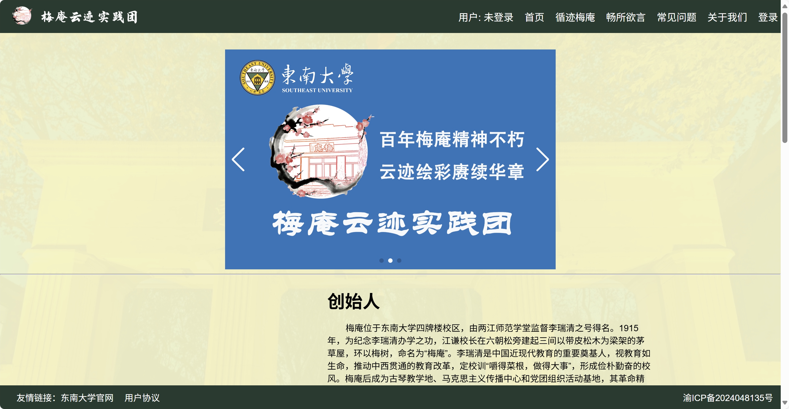
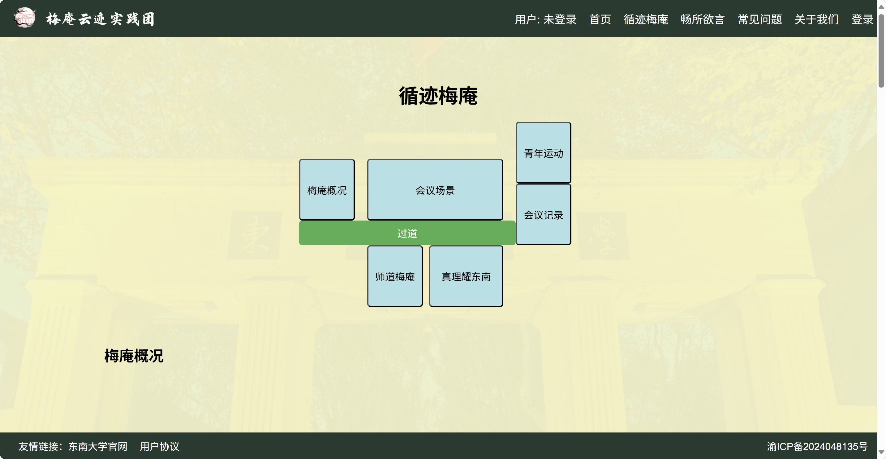
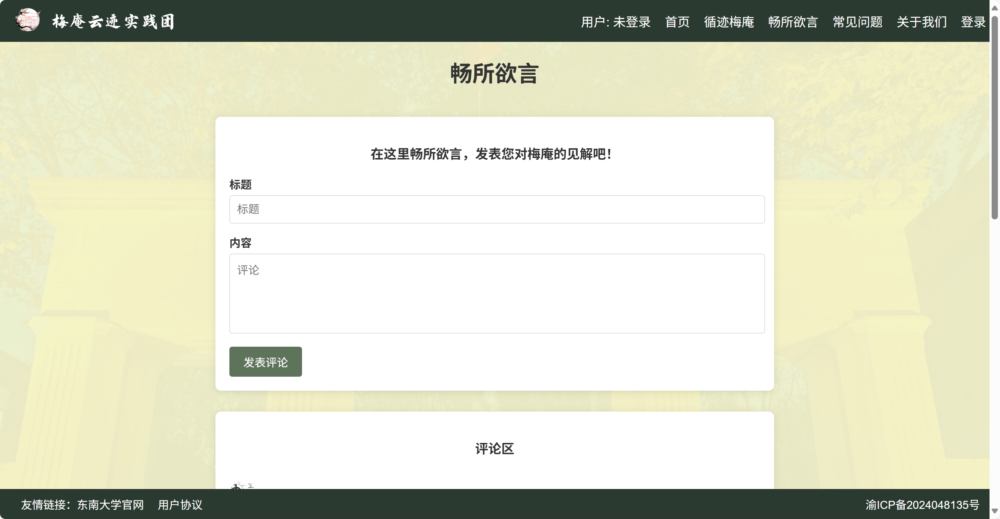
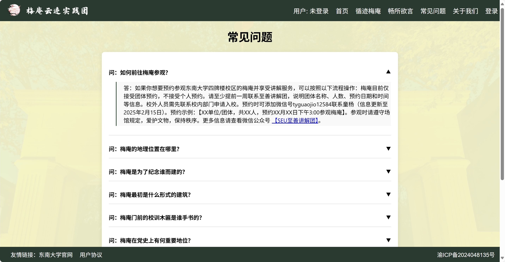
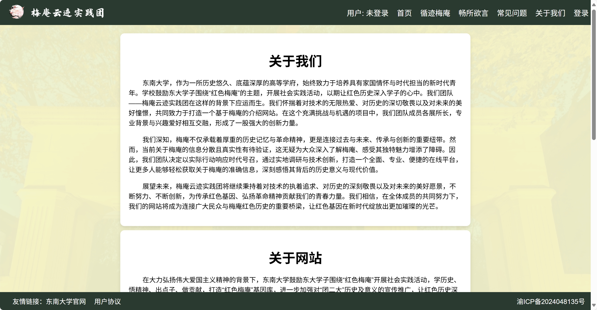

# 梅庵云迹网站项目
[**English**](README.md) | [简体中文](#)  
*(English version is available [here](README.md).)*

## 项目简介
“梅庵云迹”是一个由梅庵云迹实践团策划并实施的、以数字化手段展示东南大学梅庵历史文化的网站。项目通过前端与后端技术结合，实现了梅庵文化展示、用户互动、评论管理等功能，旨在让更多人了解梅庵的历史底蕴与独特魅力。

---

## 技术栈
### 前端
- **核心技术**：HTML5、CSS3、JavaScript
- **动画效果**：淡入淡出页面切换、动态组件交互
- **设计风格**：统一配色、响应式布局

### 后端
- **框架**：Django 4.2 + Python 3.11
- **功能实现**：用户认证、评论管理、动态模板渲染
- **数据库**：MySQL

---

## 功能模块介绍
1. **首页**  
   “首页”主要介绍梅庵的核心信息。轮播图循环播放着梅庵介绍图以及团队队旗，展现了梅庵的风貌与我们团队的实践历程。文字部分则从梅庵的历史文化、作为团二大召开地点的特殊地位，以及其对后世的影响与意义等多个角度，对梅庵进行了全面而简短的介绍。

   

2. **循迹梅庵**  
   “循迹梅庵”板块从梅庵内部的五个展厅出发，专注于展示梅庵各个展厅的陈列内容及相关介绍。每个展厅的介绍都配以我们团队拍摄的精选照片，为访客带来了身临其境般的参观体验。为了方便访客快速找到梅庵各个位置的介绍，循迹梅庵板块还特别设置了一幅梅庵概览图，访客只需点击相应位置，即可跳转到对应展厅的详细介绍页面，极大地提升了浏览的便捷性。

   

3. **畅所欲言**  
   “畅所欲言”板块此为网站的互动评论区，用户登录后可在该板块提出建议、问题或发表观点。同时，我们团队及其他用户可对评论进行回复，实现信息的双向交流。这一功能不仅增强了用户参与感，也为网站的持续优化提供了用户反馈渠道。

   

4. **常见问题**  
    “常见问题”板块针对用户可能提出的常见问题进行解答，内容涵盖梅庵的历史细节、参观指南、文化价值等方面。通过提前梳理并解答这些问题，能够有效提升用户体验，减少用户在浏览过程中可能遇到的困惑。 

     

5. **关于我们**  
   “关于我们”板块主要介绍开发团队的概况、网站的开发背景、技术架构以及后续发展规划等信息。通过这一板块，用户可以更全面地了解网站的制作团队及网站的运营理念，增强用户对网站的信任度。

   

6. **用户系统**  
   通过用户系统，用户可以注册并登录，登录后，用户可以在个人中心设置头像、修改个人信息（如性别、生日、个性签名等），以及修改密码，极大地完善了用户的使用体验。

---

## 访问方式
- **线上地址**：[https://www.meiancloud.site](https://www.meiancloud.site)  
- **本地部署**：
```shell
# 首先确保已经安装了python 3.11
# 克隆仓库
git clone https://github.com/r1Way/meiancloud
# 转入项目地址
cd ./meiancloud/meiancloud
# 安装依赖
pip3 install -r requirements.txt
# 启动服务
python3 manage.py runserver
```  
---
## 开发人员
感谢梅庵云迹实践团全体人员的努力与付出。

特别感谢以下核心开发人员的贡献：

<table>
  <tr>
    <td align="center">
      <a href="https://github.com/r1Way">
        
        <br />
        <sub><b>r1Way(组长)</b></sub>
      </a>
    </td>
    <td align="center">
      <a href="https://github.com/WeiKnight0">
        
        <br />
        <sub><b>WeiKnight</b></sub>
      </a>
    </td>
  </tr>
</table>

感谢他们夜以继日的编码、调试和优化，才让这个项目得以实现！

⭐ **如果这个项目对你有帮助，请给我们一个Star！** ⭐  
你的支持是我们持续改进的最大动力。 [[项目地址]](https://github.com/r1Way/meiancloud)


---

## 版权声明
- 梅庵历史资料版权归东南大学所有
- 网站所有权归梅庵云迹实践团所有
- 网站代码开源协议：MIT License
- 图片素材需注明来源

---
---
# 附录：网站搭建经验分享 
<!-- 
# 梅庵云迹网站

[网站链接www.meiancloud.site](https://meiancloud.site/)

## 项目地址

[r1Way/meian_web: meiancloud](https://github.com/r1Way/meian_web) -->

## 前端基础

html+css+js

[全网首发AI+JavaWeb开发入门，Tlias教学管理系统项目实战全套视频教程，从需求分析、设计、前后端开发、测试、程序优化到项目部署一套搞定](https://www.bilibili.com/video/BV1yGydYEE3H?vd_source=ec4e4974e1b56ed330afdb6c6ead1501)

> 帮助文档参考 [MDN Web Docs](https://developer.mozilla.org/zh-CN/) 

## 网站上线流程

[【合集完结】想上线网站？通俗易懂的网站上线部署发布教程 | 个人网站如何托管建站 | 服务器 IP DNS CDN 备案 工作原理 | 腾讯云开发静态网站托管](https://www.bilibili.com/video/BV18a4y1Y7e9?p=6&vd_source=ec4e4974e1b56ed330afdb6c6ead1501)

## 腾讯云部署文档

[域名注册购买_域名注册选购 - 腾讯云](https://buy.cloud.tencent.com/domain)

[域名注册 单个域名注册-注册新域名-文档中心-腾讯云](https://cloud.tencent.com/document/product/242/9595)

[ICP 备案 如何快速备案您的网站或 APP-快速入门-文档中心-腾讯云](https://cloud.tencent.com/document/product/243/39038)

[我的备案 - ICP备案 - 控制台](https://console.cloud.tencent.com/beian/manage/material)

[轻量应用服务器 安装和配置宝塔 Linux 面板腾讯云专享版-实践教程-文档中心-腾讯云](https://cloud.tencent.com/document/product/1207/54078)

## Django框架

该框架用于构建后端

>  [Python-Django手把手从零开发个人博客](https://www.bilibili.com/video/BV1iU4y1A7MH?vd_source=ec4e4974e1b56ed330afdb6c6ead1501)

入门

>  [编写你的第一个 Django 应用，第 1 部分 | Django 文档 | Django](https://docs.djangoproject.com/zh-hans/5.1/intro/tutorial01/)
